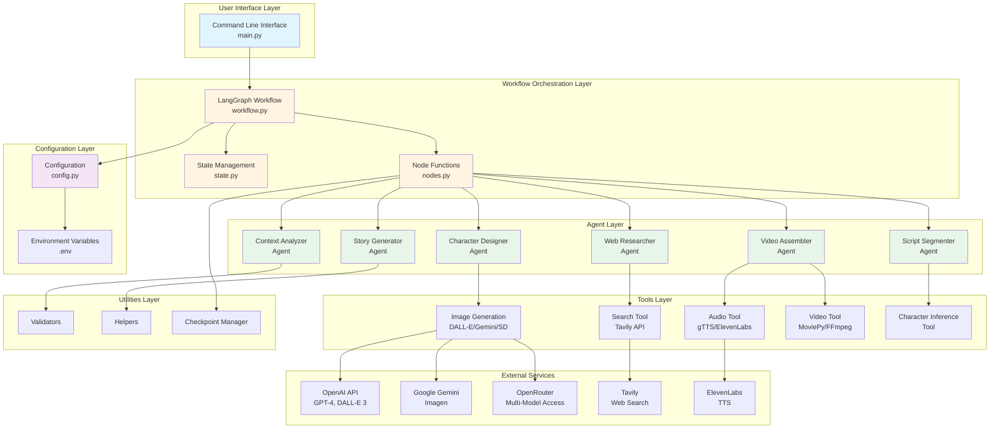
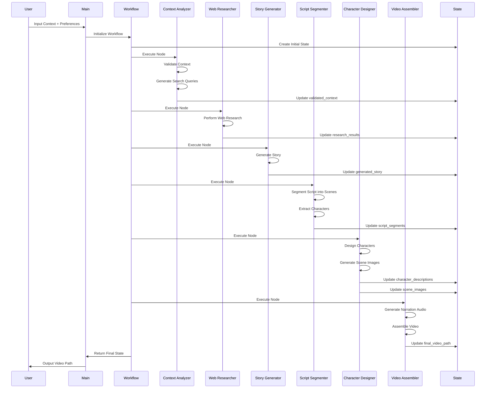
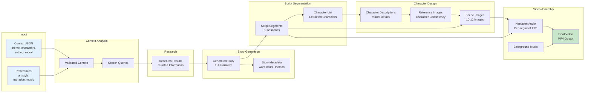
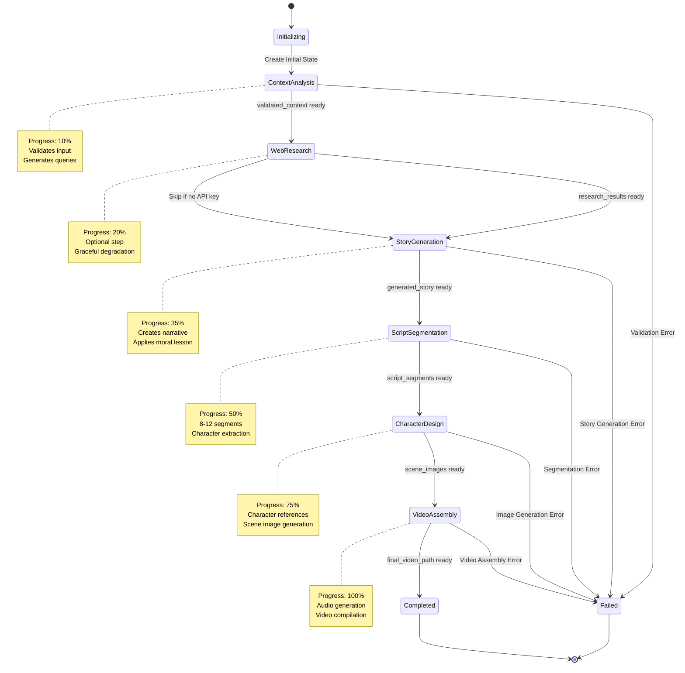
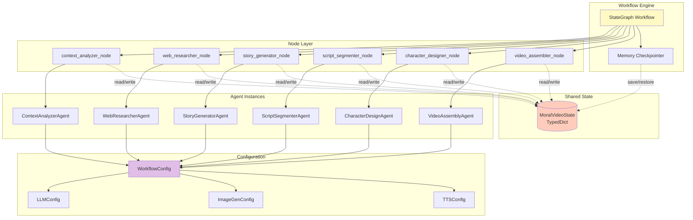
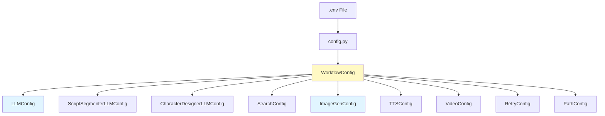
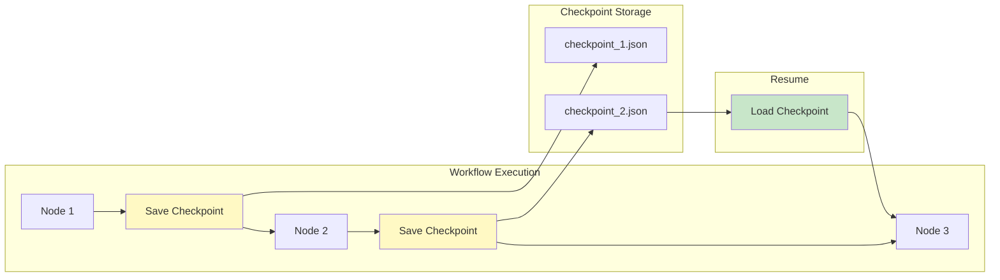
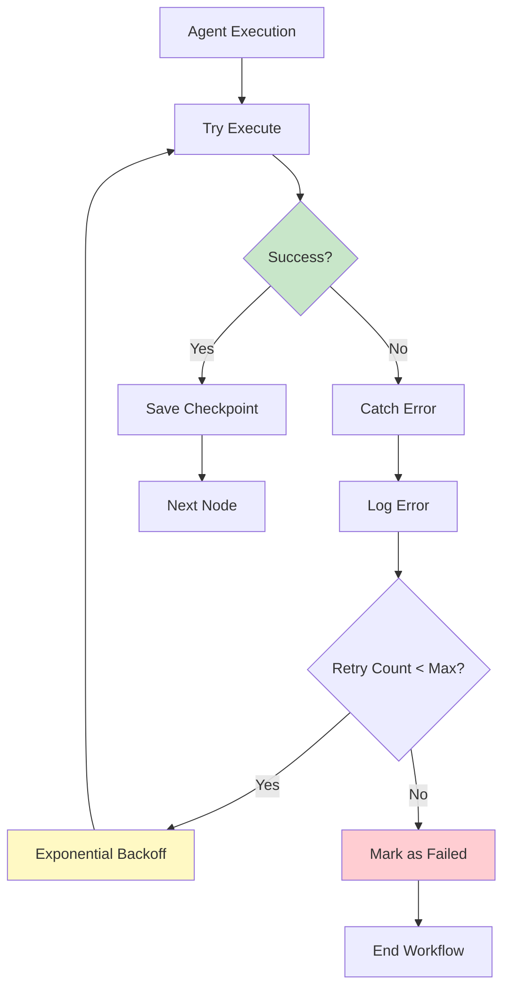

# Multi-Agent Moral Story Video Workflow System - Architecture Documentation

## Table of Contents
1. [System Overview](#system-overview)
2. [Architecture Diagrams](#architecture-diagrams)
3. [Component Details](#component-details)
4. [Workflow Orchestration](#workflow-orchestration)
5. [State Management](#state-management)
6. [Configuration System](#configuration-system)
7. [Agent Architecture](#agent-architecture)
8. [Tools and Utilities](#tools-and-utilities)
9. [Data Flow](#data-flow)
10. [API Integrations](#api-integrations)
11. [Checkpoint and Resume System](#checkpoint-and-resume-system)
12. [Error Handling and Retry Logic](#error-handling-and-retry-logic)

---

## System Overview

The Multi-Agent Moral Story Video Workflow System is a production-grade AI-powered application that transforms story contexts into complete animated videos for children. Built on **LangChain** and **LangGraph**, it orchestrates six specialized agents in a coordinated workflow.

### Key Features

- **Multi-Agent Architecture**: Six specialized agents working collaboratively
- **LangGraph Workflow**: Sophisticated state management and agent coordination
- **Checkpoint & Resume**: Automatic progress saving with resume capability
- **Flexible LLM Configuration**: Agent-specific models, API keys, and settings
- **Multi-Provider Image Generation**: DALL-E 3, Gemini Imagen, OpenRouter SD support
- **Character Consistency**: Automated character reference system
- **Perfect Audio-Video Sync**: Per-segment narration with hybrid flow
- **Child-Safe Content**: Content filtering at every stage
- **Production-Ready**: Comprehensive logging, validation, and observability

### Technology Stack

- **Framework**: LangChain, LangGraph
- **Language**: Python 3.10+
- **LLM Providers**: OpenAI, OpenRouter, or any OpenAI-compatible endpoint
- **Image Generation**: DALL-E 3, Google Gemini Imagen, Stable Diffusion (via OpenRouter)
- **Video Processing**: MoviePy, FFmpeg, ImageMagick
- **Audio**: gTTS, ElevenLabs (optional)
- **Web Search**: Tavily (optional)

---

## Architecture Diagrams

### System Architecture



### Agent Workflow Sequence



### Data Flow Architecture



### State Flow Diagram



### Component Interaction Diagram



---

## Component Details

### 1. Main Entry Point (`main.py`)

**Purpose**: Command-line interface and workflow orchestration entry point

**Key Responsibilities**:
- Parse command-line arguments
- Load input from JSON files or use example data
- Validate input context
- Estimate costs before execution
- Handle checkpoint/resume operations
- Execute workflow with progress callbacks
- Display final results

**Key Functions**:
- `load_input_from_file()`: Load JSON input
- `progress_callback()`: Display progress updates
- `main()`: Main execution flow

**Command-Line Options**:
```bash
--input, -i          # Input JSON file path
--output, -o         # Output directory
--log-level          # Logging level (DEBUG, INFO, WARNING, ERROR)
--workflow-id        # Unique workflow identifier
--resume             # Resume from latest checkpoint
--resume-from-step   # Resume from specific step
--estimate-cost      # Show cost estimate before execution
--list-checkpoints   # List available checkpoints
```

### 2. Workflow Orchestration (`graph/`)

#### `workflow.py`

**Purpose**: LangGraph workflow creation and execution

**Key Functions**:
- `create_workflow()`: Build StateGraph with nodes and edges
- `run_workflow()`: Execute workflow with initial state
- `run_workflow_with_callbacks()`: Execute with progress callbacks and resume support

**Workflow Structure**:
```python
# Linear workflow with automatic checkpointing
context_analyzer → web_researcher → story_generator → 
script_segmenter → character_designer → video_assembler → END
```

#### `state.py`

**Purpose**: State schema and management

**Key Components**:
- `MoralVideoState`: TypedDict defining all workflow data
- `create_initial_state()`: Initialize workflow state
- `update_progress()`: Update progress tracking
- `add_error()`: Record errors with retry tracking
- `state_to_dict()` / `state_from_dict()`: Serialization for checkpoints

**State Schema**:
```python
class MoralVideoState(TypedDict):
    # Input
    input_context: Dict[str, Any]
    input_preferences: Dict[str, Any]
    
    # Agent Outputs
    validated_context: Dict[str, Any]
    research_results: Dict[str, Any]
    generated_story: str
    script_segments: List[Dict[str, Any]]
    character_descriptions: Dict[str, Dict[str, Any]]
    scene_images: List[str]
    final_video_path: str
    
    # Workflow Metadata
    workflow_id: str
    progress: float
    status: str
    errors: List[Dict[str, Any]]
    # ... and more
```

#### `nodes.py`

**Purpose**: Node wrapper functions for each agent

**Key Functions**:
- `context_analyzer_node()`: Wraps ContextAnalyzerAgent
- `web_researcher_node()`: Wraps WebResearcherAgent
- `story_generator_node()`: Wraps StoryGeneratorAgent
- `script_segmenter_node()`: Wraps ScriptSegmenterAgent
- `character_designer_node()`: Wraps CharacterDesignAgent
- `video_assembler_node()`: Wraps VideoAssemblyAgent
- `should_retry()`: Retry decision logic
- `check_quality()`: Quality validation

**Node Pattern**:
```python
def agent_node(state: MoralVideoState) -> Dict[str, Any]:
    # 1. Check if already completed (for resume)
    # 2. Update progress
    # 3. Initialize agent
    # 4. Execute agent logic
    # 5. Update state with results
    # 6. Save checkpoint
    # 7. Return state updates
```

---

## Agent Architecture

### Agent Design Pattern

All agents follow a consistent design pattern:

```python
class AgentName:
    def __init__(self):
        self.config = get_config()
        self.llm = ChatOpenAI(...)  # LLM configuration
        self.system_prompt = "..."  # Agent-specific instructions
        self.human_prompt = "..."   # User input template
    
    def execute(self, input_data: Dict) -> Dict:
        # 1. Validate input
        # 2. Create prompt
        # 3. Call LLM
        # 4. Parse response
        # 5. Validate output
        # 6. Return results
```

### 1. Context Analyzer Agent

**File**: `agents/context_analyzer.py`

**Purpose**: Parse and validate input context, generate search queries

**Input**:
- `input_context`: Theme, characters, setting, moral lesson, age group
- `input_preferences`: Art style, narration, music

**Output**:
- `validated_context`: Validated and enriched context
- `search_queries`: List of search queries for research

**Key Features**:
- Input validation using Pydantic models
- Fallback to basic validation if LLM fails
- Search query generation for knowledge enrichment

### 2. Web Researcher Agent

**File**: `agents/web_researcher.py`

**Purpose**: Gather supplementary information via web search

**Input**:
- `search_queries`: Generated by Context Analyzer
- `validated_context`: For context-aware research

**Output**:
- `research_results`: Curated research data
- `research_summary`: Text summary of findings

**Key Features**:
- Tavily API integration
- Child-safety filtering
- Graceful degradation if API unavailable
- Content curation and summarization

### 3. Story Generator Agent

**File**: `agents/story_generator.py`

**Purpose**: Create engaging moral stories for children

**Input**:
- `validated_context`: Theme, characters, setting, moral
- `research_results`: Optional supplementary information

**Output**:
- `generated_story`: Complete narrative text
- `story_metadata`: Word count, estimated reading time, themes

**Key Features**:
- Age-appropriate storytelling
- Moral lesson integration
- Character development
- Engaging narrative structure

### 4. Script Segmenter Agent

**File**: `agents/script_segmenter.py`

**Purpose**: Break story into 8-12 visual scenes with detailed descriptions

**Input**:
- `generated_story`: Full story text
- `validated_context`: Character and setting information

**Output**:
- `script_segments`: List of scene objects with:
  - `scene_number`: Sequential number
  - `description`: Detailed scene description (2-3 sentences)
  - `characters`: Characters present in scene
  - `dialogue`: Optional dialogue
  - `narration`: Scene narration text
  - `duration_seconds`: Scene duration
  - `setting`: Scene background description
  - `emotions`: Character emotions

**Key Features**:
- 8-12 segment validation
- Character extraction and inference
- Elaborate scene backgrounds (lighting, atmosphere, mood)
- Per-segment narration for audio-video sync
- Duration calculation based on narration length

### 5. Character Designer Agent

**File**: `agents/character_designer.py`

**Purpose**: Generate consistent character visuals and scene images

**Input**:
- `script_segments`: Scene descriptions
- `validated_context`: Character information

**Output**:
- `character_descriptions`: Visual details for each character
- `scene_images`: List of generated image paths

**Key Features**:
- Character reference generation (first appearance)
- Visual consistency across scenes
- Multi-provider image generation support
- Character visual description extraction (for text-based providers)
- Optimized character reference processing

**Character Consistency Strategy**:
1. Generate reference image for each character on first appearance
2. Extract detailed visual description using GPT-4 Vision (if needed)
3. Include character descriptions in all subsequent scene prompts
4. Maintain consistent art style across all images

### 6. Video Assembler Agent

**File**: `agents/video_assembler.py`

**Purpose**: Compile media into final video with narration and music

**Input**:
- `scene_images`: Generated scene images
- `script_segments`: Scene data with narration
- `input_preferences`: Narration and music preferences

**Output**:
- `final_video_path`: Path to compiled MP4 video

**Key Features**:
- Per-segment narration generation (gTTS or ElevenLabs)
- Perfect audio-video synchronization
- Scene duration matching narration length
- Background music integration
- Moral message end card
- Crossfade transitions
- 1920x1080 resolution output

**Audio-Video Sync Strategy**:
1. Generate narration audio for each segment
2. Calculate segment duration from audio length
3. Display scene image for exact narration duration
4. Add crossfade transitions between scenes
5. Mix background music at 30% volume

---

## Tools and Utilities

### 1. Search Tool (`tools/search_tool.py`)

**Purpose**: Web search integration via Tavily API

**Key Functions**:
- `search()`: Execute search query with child-safety filtering
- `search_multiple()`: Batch search for multiple queries

**Features**:
- Child-safe content filtering
- Result ranking and curation
- Graceful degradation if API unavailable

### 2. Image Generation Tool (`tools/image_gen_tool.py`)

**Purpose**: Multi-provider image generation

**Supported Providers**:
- **DALL-E 3**: OpenAI (highest quality, recommended)
- **Gemini Imagen**: Google (good quality)
- **OpenRouter SD**: Stable Diffusion (cost-effective)

**Key Functions**:
- `generate_image()`: Generate image with specified provider
- `analyze_character_image()`: Extract visual description using GPT-4 Vision
- `summarize_character_descriptions()`: Summarize long character descriptions

**Provider-Specific Methods**:
- `_generate_dalle3()`: DALL-E 3 API integration
- `_generate_gemini()`: Gemini Imagen API integration
- `_generate_openrouter_sd()`: OpenRouter API integration

**Character Consistency**:
- Text-based providers (DALL-E 3, Gemini, OpenRouter SD) use detailed character descriptions in prompts
- Character reference images analyzed via GPT-4 Vision to extract visual details
- Visual descriptions included in all scene generation prompts

### 3. Audio Tool (`tools/audio_tool.py`)

**Purpose**: Text-to-speech generation

**Supported Providers**:
- **gTTS**: Free, Google Text-to-Speech (default)
- **ElevenLabs**: Premium, high-quality TTS (optional)

**Key Functions**:
- `generate_narration()`: Generate narration audio from text
- `get_audio_duration()`: Calculate audio file duration

### 4. Video Tool (`tools/video_tool.py`)

**Purpose**: Video compilation and processing

**Key Functions**:
- `create_video_from_images()`: Compile images into video
- `add_audio_to_video()`: Sync audio with video
- `create_end_card()`: Generate moral message end card
- `add_background_music()`: Mix background music

**Dependencies**:
- **MoviePy**: Video editing
- **FFmpeg**: Video encoding
- **ImageMagick**: Text overlay for end cards

### 5. Character Inference Tool (`tools/character_inference_tool.py`)

**Purpose**: Infer characters from scene descriptions

**Key Functions**:
- `infer_characters_from_segment()`: Extract character names from text using LLM

**Features**:
- Context-aware character extraction
- Handles implicit character references
- Validates against known character list

### 6. Validators (`utils/validators.py`)

**Purpose**: Input validation and schema checking

**Key Functions**:
- `validate_input()`: Validate input JSON structure
- `validate_context()`: Validate context fields
- `validate_preferences()`: Validate preference fields

### 7. Helpers (`utils/helpers.py`)

**Purpose**: Utility functions

**Key Functions**:
- `setup_logging()`: Configure logging
- `get_output_path()`: Generate output file paths
- `estimate_cost()`: Estimate API costs
- `format_duration()`: Format time durations
- `sanitize_text()`: Handle Unicode encoding issues (Windows)

### 8. Checkpoint Manager (`utils/checkpoint_manager.py`)

**Purpose**: Checkpoint creation and restoration

**Key Functions**:
- `save_checkpoint()`: Save workflow state to disk
- `load_checkpoint()`: Restore workflow state
- `list_checkpoints()`: List available checkpoints
- `get_latest_checkpoint()`: Get most recent checkpoint

**Checkpoint Structure**:
```
temp/checkpoints/{workflow_id}/
├── context_analyzer_{timestamp}.json
├── web_researcher_{timestamp}.json
├── story_generator_{timestamp}.json
├── script_segmenter_{timestamp}.json
├── character_designer_{timestamp}.json
└── video_assembler_{timestamp}.json
```

---

## Configuration System

### Configuration Architecture

The system uses a hierarchical configuration system with environment variable overrides:



### Configuration Classes

#### `LLMConfig`
Global LLM settings for most agents

**Fields**:
- `provider`: "openai"
- `model`: Model name (e.g., "gpt-4-turbo")
- `temperature`: 0.7
- `max_tokens`: 5000
- `api_key`: From `LLM_API_KEY`
- `base_url`: From `LLM_BASE_URL` (optional)

#### `ScriptSegmenterLLMConfig`
Separate LLM configuration for Script Segmenter (supports higher token limits)

**Environment Variables**:
- `SCRIPT_SEGMENTER_API_KEY` (falls back to `LLM_API_KEY`)
- `SCRIPT_SEGMENTER_BASE_URL` (falls back to `LLM_BASE_URL`)
- `SCRIPT_SEGMENTER_MODEL`
- `SCRIPT_SEGMENTER_MAX_TOKENS` (default: 12000)

#### `CharacterDesignerLLMConfig`
Separate LLM configuration for Character Designer

**Environment Variables**:
- `CHARACTER_DESIGNER_API_KEY`
- `CHARACTER_DESIGNER_BASE_URL`
- `CHARACTER_DESIGNER_MODEL`

#### `ImageGenConfig`
Multi-provider image generation configuration

**Providers**:
- `dalle3`: DALL-E 3 (OpenAI)
- `gemini`: Imagen (Google)
- `openrouter-sd`: Stable Diffusion (OpenRouter)

**Environment Variables**:
- `IMAGE_GEN_PROVIDER`: Provider selection
- `IMAGE_GEN_API_KEY`: Universal API key
- `OPENAI_API_KEY`: DALL-E 3 specific
- `GEMINI_API_KEY`: Gemini specific
- `OPENROUTER_API_KEY`: OpenRouter specific
- `IMAGE_GEN_MODEL`: Model override
- `IMAGE_GEN_SIZE`: Image size (default: "1024x1024")
- `IMAGE_GEN_QUALITY`: "standard" or "hd"
- `IMAGE_GEN_STYLE`: "vivid" or "natural"

#### `TTSConfig`
Text-to-speech configuration

**Providers**:
- `gtts`: Google TTS (free, default)
- `elevenlabs`: ElevenLabs (premium)

**Environment Variables**:
- `ELEVENLABS_API_KEY`

#### `PathConfig`
Directory configuration

**Paths**:
- `output_dir`: Final video output (default: "output/")
- `temp_dir`: Temporary files (default: "temp/")
- `images_dir`: Generated images (default: "temp/images/")
- `audio_dir`: Audio files (default: "temp/audio/")
- `checkpoint_dir`: Checkpoints (default: "temp/checkpoints/")

### Configuration Usage

```python
from config import get_config

config = get_config()

# Access LLM settings
llm = ChatOpenAI(
    model_name=config.llm.model,
    temperature=config.llm.temperature,
    api_key=config.llm.api_key,
    base_url=config.llm.base_url
)

# Access image generation settings
provider = config.image_gen.provider
api_key = config.image_gen.api_key
```

---

## Checkpoint and Resume System

### Architecture



### Checkpoint Features

1. **Automatic Saving**: After each agent node completion
2. **Resume from Latest**: `--resume` flag
3. **Resume from Specific Step**: `--resume-from-step` flag
4. **Checkpoint Listing**: `--list-checkpoints` flag
5. **Retention Management**: Keep last 10 checkpoints per workflow

### Checkpoint Data

Each checkpoint contains:
- Full workflow state (all agent outputs)
- Metadata (timestamp, step name, workflow ID)
- Progress tracking
- Error history

### Usage Examples

```bash
# Run with checkpointing enabled
python main.py -i story.json --workflow-id my-video-001

# Resume from latest checkpoint
python main.py --workflow-id my-video-001 --resume

# Resume from specific step
python main.py --workflow-id my-video-001 --resume-from-step video_assembler

# List available checkpoints
python main.py --workflow-id my-video-001 --list-checkpoints
```

---

## Error Handling and Retry Logic

### Error Handling Strategy



### Retry Configuration

**Settings** (`RetryConfig`):
- `max_retries`: 3
- `initial_backoff`: 1.0 seconds
- `max_backoff`: 60.0 seconds
- `exponential_base`: 2.0

**Retry Formula**:
```python
backoff = min(initial_backoff * (exponential_base ** retry_count), max_backoff)
```

### Error Types

1. **Validation Errors**: Input schema violations
2. **API Errors**: LLM, image generation, search API failures
3. **Processing Errors**: Video assembly, audio generation failures
4. **Network Errors**: Timeout, connection issues

### Graceful Degradation

- **Web Research**: Skip if Tavily API unavailable
- **Image Generation**: Retry with different provider if configured
- **TTS**: Fall back from ElevenLabs to gTTS
- **End Card**: Skip if ImageMagick unavailable

---

## API Integrations

### LLM Providers

**Supported**:
- OpenAI (GPT-4, GPT-3.5)
- OpenRouter (multi-model access)
- Any OpenAI-compatible endpoint

**Usage**:
```python
from langchain_openai import ChatOpenAI

llm = ChatOpenAI(
    model_name="gpt-4-turbo",
    temperature=0.7,
    api_key=os.getenv("LLM_API_KEY"),
    base_url=os.getenv("LLM_BASE_URL")  # Optional
)
```

### Image Generation Providers

#### DALL-E 3 (OpenAI)
```python
from openai import OpenAI

client = OpenAI(api_key=api_key)
response = client.images.generate(
    model="dall-e-3",
    prompt=prompt,
    size="1024x1024",
    quality="standard",
    n=1
)
```

#### Gemini Imagen (Google)
```python
import google.generativeai as genai

genai.configure(api_key=api_key)
model = genai.GenerativeModel('imagen-3.0-generate-001')
response = model.generate_images(
    prompt=prompt,
    number_of_images=1
)
```

#### OpenRouter SD
```python
response = requests.post(
    "https://openrouter.ai/api/v1/chat/completions",
    headers={"Authorization": f"Bearer {api_key}"},
    json={
        "model": "google/gemini-pro-1.5",
        "messages": [{"role": "user", "content": prompt}],
        "modalities": ["image"]
    }
)
```

### Web Search (Tavily)

```python
from tavily import TavilyClient

client = TavilyClient(api_key=api_key)
results = client.search(
    query=query,
    max_results=5,
    include_domains=["educational sites"],
    exclude_domains=["adult content"]
)
```

### Text-to-Speech

#### gTTS (Free)
```python
from gtts import gTTS

tts = gTTS(text=text, lang='en', slow=False)
tts.save(output_path)
```

#### ElevenLabs (Premium)
```python
from elevenlabs import generate, save

audio = generate(
    text=text,
    voice="Bella",
    model="eleven_monolingual_v1"
)
save(audio, output_path)
```

---

## Best Practices

### 1. Configuration Management
- Use `.env` file for API keys (never commit to version control)
- Use agent-specific configurations for specialized needs
- Set appropriate token limits based on agent complexity

### 2. Cost Optimization
- Use `--estimate-cost` before execution
- Consider OpenRouter SD for cost-effective image generation
- Use gTTS instead of ElevenLabs for free TTS
- Implement checkpointing to avoid re-running expensive steps

### 3. Error Handling
- Always enable checkpointing for long-running workflows
- Monitor retry counts and adjust max_retries if needed
- Review error logs for API rate limiting issues
- Implement graceful degradation for optional features

### 4. Performance
- Use appropriate LLM models (GPT-4 for quality, GPT-3.5 for speed)
- Optimize image generation batch sizes
- Cache character reference images
- Use per-segment narration for better audio-video sync

### 5. Quality Assurance
- Validate input context before execution
- Review generated stories for age-appropriateness
- Check character consistency across scenes
- Verify audio-video synchronization

---

## Troubleshooting

### Common Issues

1. **ImageMagick Not Found**
   - Install ImageMagick with legacy utilities
   - Add to system PATH
   - Set `IMAGEMAGICK_BINARY` in `.env`

2. **gTTS Errors**
   - Check network connectivity
   - Reinstall gTTS: `pip install --upgrade gtts`
   - Use ElevenLabs as alternative

3. **Image Generation Failures**
   - Verify API key and credits
   - Check rate limits (DALL-E 3: 5 images/minute)
   - Try alternative provider (Gemini, OpenRouter SD)

4. **Memory Issues**
   - Reduce number of scenes (shorter duration)
   - Lower image resolution
   - Close other applications

5. **Checkpoint Issues**
   - Ensure `temp/checkpoints/` directory exists
   - Check disk space
   - Verify workflow ID matches

For detailed troubleshooting, see [TROUBLESHOOTING.md](file:///c:/cursor/animation/TROUBLESHOOTING.md).

---

## Conclusion

This architecture document provides a comprehensive overview of the Multi-Agent Moral Story Video Workflow System. The system demonstrates production-grade design principles including:

- **Modularity**: Clear separation of concerns across agents, tools, and utilities
- **Extensibility**: Easy to add new agents, tools, or providers
- **Reliability**: Comprehensive error handling and checkpoint/resume capabilities
- **Configurability**: Flexible configuration system with environment variable overrides
- **Observability**: Detailed logging, progress tracking, and state management

For implementation details, refer to the source code and additional documentation files in the project repository.
